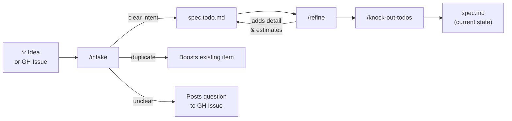
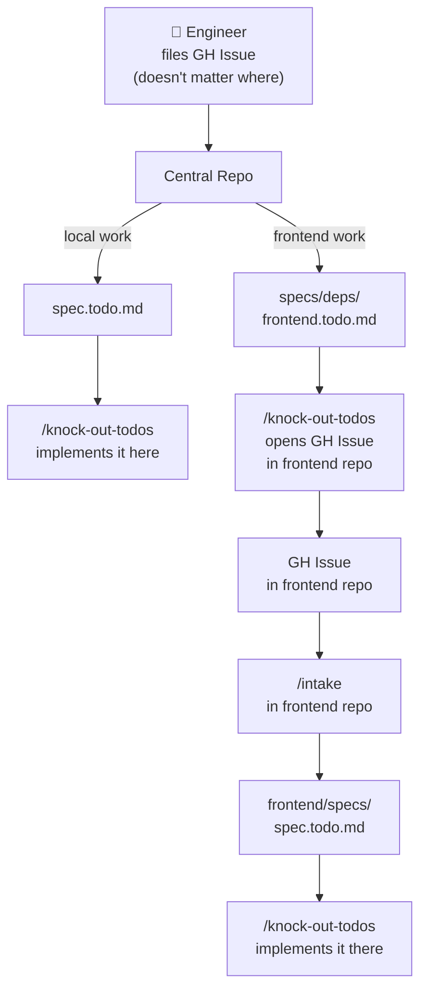

# Spec Template — Commands

A quick guide for humans. Read this before diving into the command files.

---

## What is this?

Commands that make spec-driven development feel automatic.

The idea: **ideas go in, specs come out, code follows specs.** The commands handle the boring parts — filing ideas, picking up work, keeping docs in sync.

---

## Commands at a glance

| Command | What it does |
|---------|--------------|
| `/what-now` | Not sure where to start? Assesses your repo and recommends the right next step |
| `/intake` | Sort ideas and GitHub Issues into the right TODO spec |
| `/refine` | Add detail and effort estimates to TODO items before implementing |
| `/knock-out-todos` | Implement TODO items from spec files |
| `/pr-review` | Self-review open PRs and respond to reviewer comments |
| `/spec-backfill` | Generate specs from an existing codebase |

---

## The basic flow



**Step by step:**

1. Drop an idea in `specs/INTAKE.md` (or file a GitHub Issue).
2. Run `/what-now` and choose **File ideas** — it routes each item to the right `spec.todo.md`.
3. *(Optional)* Run `/what-now` and choose **Add detail** — adds effort estimates and implementation notes before coding starts.
4. Run `/what-now` and choose **Implement TODO items** — picks up the easiest items and implements them.
5. When work is done, the description moves from `spec.todo.md` to `spec.md`.

**Practical example:**

> You think: "We should add dark mode."
> You drop it in INTAKE.md and run `/intake`.
> It lands in `specs/ui.todo.md` as `- [ ] Add dark mode toggle`.
> You run `/knock-out-todos`. It implements the toggle and updates `specs/ui.spec.md`.

---

## Starting from existing code

New to the system but already have a codebase? Run `/spec-backfill`.

It scans your source tree, creates spec files for every module, and marks anything it can't figure out with `> **TODO:**`. Fill those in over time. Re-run it anytime to check coverage.

```
/spec-backfill                        ← scan everything, show gaps
/spec-backfill go deep in src/auth   ← read the auth code and fill it in
```

---

## Cross-repo: the central intake hub

The real power move: use **one repo as the intake point for your whole org**.

Engineers file issues there regardless of which codebase the work belongs to. `/intake` routes each one. Work that belongs in another repo lands in `specs/deps/{repo}.todo.md`. `/knock-out-todos` opens the downstream GitHub Issue. That downstream repo runs its own `/intake` and picks it up.



**Why this works:**
- Engineers file issues anywhere. Routing is not their problem.
- Every step is traceable — each issue links to the one that spawned it.
- Humans stay in control. Commands surface questions; engineers answer them.

---

## Tips

- **`/what-now` is the only command you run directly.** Everything else lives in `lib/` and is invoked through it.
- **File ideas often.** Drop things in `specs/INTAKE.md` while they're fresh, then let `/what-now` route them.
- **`spec.md` = current, `spec.todo.md` = planned.** Keep them honest.
- **`/knock-out-todos` defaults to 5 items.** When using `/what-now` → Implement, pass a number to change it: `5`.
- **GH Issues get labeled.** `intake:filed`, `intake:rejected`, `intake:ignore`. Processed issues are never re-ingested.
- **Items waiting for more info stay in INTAKE.md.** Intake will re-surface them after 7 days. You can snooze them if needed.
