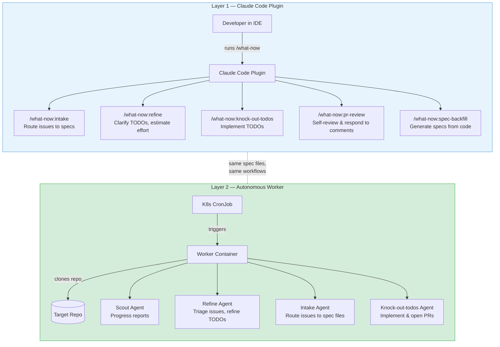
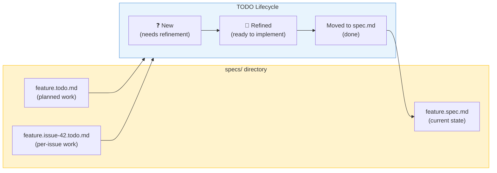
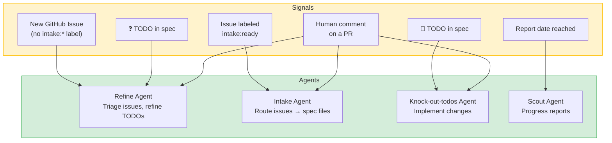
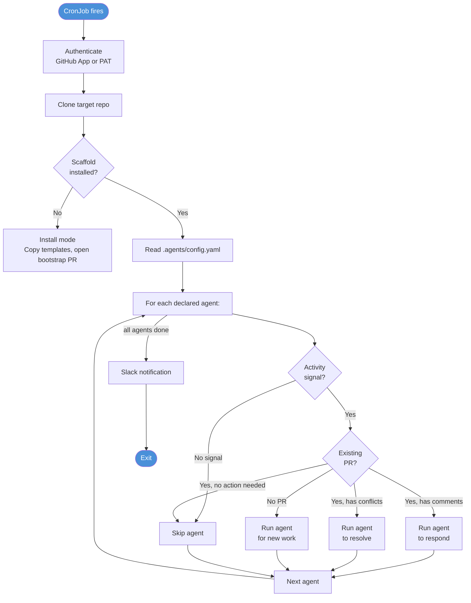
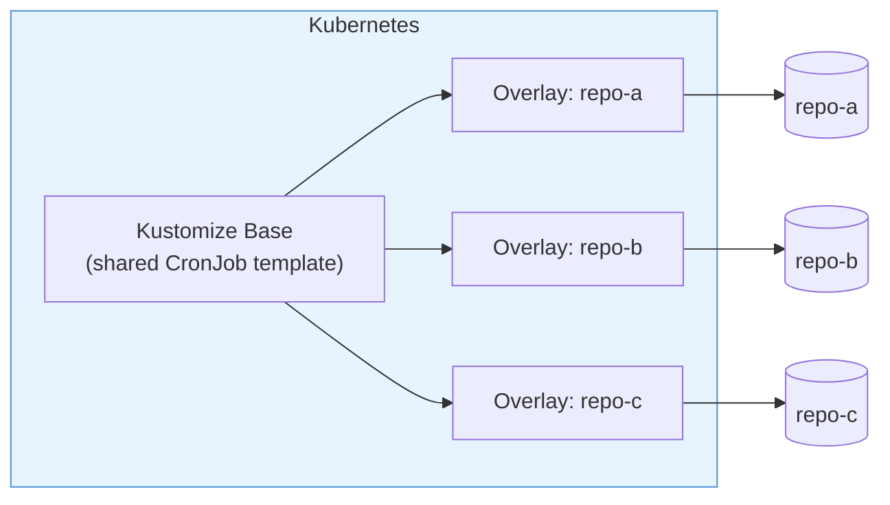

# How Spec Template Works

> *This page is for technical leaders and engineers who want to understand the system architecture. For the executive summary, see [Overview](overview.md).*

---

## Architecture: Two Independent Layers

Spec Template has two layers. A repo can use either one independently — Layer 1 is interactive (human-in-the-loop), Layer 2 is autonomous (agents run on their own).



### Layer 1 — Claude Code Plugin (Interactive)

The plugin gives developers a set of commands accessible via `/what-now` in Claude Code. It's the on-ramp: install it, run the command, and the assistant walks you through what needs doing in your repo.

**Install:** `claude plugin install spec-template@NoahWright87/spec-template`

The plugin works with spec files that live in your repo's `specs/` directory. These are plain markdown — no special tooling, no database, no external service.

### Layer 2 — Autonomous Worker (Unattended)

The worker is a Docker container that runs on a schedule via Kubernetes CronJobs. It clones a target repo, checks what needs doing, runs the appropriate agents, and exits. Each agent gets its own branch and PR.

The worker is completely optional. Many teams start with Layer 1 (interactive) and add Layer 2 when they're ready for full automation.

---

## The Spec System

Specs are the backbone. They're plain markdown files that describe what the system does (current state) and what's planned (TODOs). The AI reads specs before writing code and updates them after.



### File types

| File | Purpose |
|------|---------|
| `specs/spec.md` | Root spec — what the system does today |
| `specs/feature.spec.md` | Feature-specific current state |
| `specs/feature.todo.md` | Planned work for a feature |
| `specs/feature.issue-N.todo.md` | Work tied to a specific GitHub issue (prevents merge conflicts between agents) |
| `specs/AGENTS.md` | Instructions for agents working in this repo's specs |
| `specs/INTAKE.md` | Intake bucket for raw ideas |

### TODO lifecycle

TODOs progress through two states:

1. **❓ (Unrefined)** — a raw idea or issue that needs clarification. The refine agent adds effort estimates, asks clarifying questions, and breaks down vague requests.
2. **💎 (Refined)** — clear, estimated, and ready to implement. The knock-out-todos agent picks these up and writes the code.

When a TODO is implemented, it's removed from the todo file and the corresponding spec.md is updated to reflect the new current state.

---

## The Agents

Four built-in agents ship with the worker. Each has a specific job and runs independently.



| Agent | Trigger | What it does |
|-------|---------|-------------|
| **Refine** | New issue without `intake:*` label, or ❓ TODOs in specs | Assesses issues, asks clarifying questions, labels `intake:ready` when clear. Refines TODOs with effort estimates. |
| **Intake** | Issue labeled `intake:ready` | Routes the issue into the correct spec TODO file. Creates per-issue files to prevent merge conflicts. |
| **Knock-out-todos** | 💎 TODOs in specs, or human comments on PR | Implements the TODO, writes code, updates specs, opens a PR. Responds to reviewer feedback. |
| **Scout** | Report interval reached | Generates periodic progress reports summarizing what agents have accomplished. |

### How agents avoid stepping on each other

- Each agent gets its **own branch** (`worker/{agent-name}/YYYY-MM-DD`) and its **own PR**
- Per-issue TODO files (`feature.issue-42.todo.md`) prevent agents from editing the same file
- **Dual PR cap** — per-agent and fleet-wide limits prevent runaway PR creation
- Agents only run when their specific **activity signal** fires (no wasted cycles)

---

## Worker Execution Flow

When the worker container starts, it follows a deterministic sequence:



Key details:
- **Scaffold detection** — if the repo hasn't been set up yet, the worker auto-installs the scaffold via a bootstrap PR
- **Activity signals** — each agent only runs when there's actual work to do (new issues, unrefined TODOs, etc.)
- **Situation report** — before each agent runs, the entrypoint pre-fetches PR state, comments, and conflict status so the agent starts with full context
- **Comment deduplication** — agents only see comments that still need a response, preventing duplicate replies across runs
- **Slack notifications** — optional per-run summaries sent to team channels

---

## Multi-Repo Deployment

The worker image is repo-agnostic. Repo-specific configuration is injected via environment variables at deploy time.



**Adding a new repo** takes three steps:
1. Create a Kustomize overlay with the repo's `TARGET_REPO` env var
2. Add it to the top-level `kustomization.yaml`
3. Deploy — the worker auto-detects whether the repo needs scaffolding

Each repo configures its own agents via `.agents/config.yaml`:

```yaml
version: 2
agents:
  - scout
  - refine
  - intake
  - knock-out-todos
settings:
  max_open_prs: 3        # max simultaneous agent PRs
  specs_dir: specs
```

---

## Safety & Guardrails

Spec Template includes several safety mechanisms:

- **Agent audit workflow** — PRs from agent branches are automatically scanned for suspicious patterns (external network calls, dynamic eval, hardcoded credentials, prompt injection markers). Findings block merge until a human reviews.
- **Auto-merge with escape hatch** — agent PRs enable auto-merge after checks pass, but this is skipped when the agent has posted a clarifying question that needs human input.
- **Zero-change abandonment** — if a PR ends up with no net file changes (e.g., after resolving a merge conflict by accepting the target branch), the agent closes the PR and reports the abandonment rather than merging an empty diff.
- **PR focus guard** — when a PR is already open, agents don't pile on unrelated changes. Large or out-of-scope reviewer requests are pushed back with a comment and tracked as a new issue.
- **Bot comment prefix** — all agent comments use a bot prefix so humans can instantly distinguish agent activity from human discussion.

---

## Further Reading

| Document | What it covers |
|----------|---------------|
| [Executive Overview](overview.md) | High-level pitch, impact stats, vision |
| [Worker README](../worker/README.md) | Deployment, authentication options, troubleshooting |
| [Kubernetes Guide](../k8s/README.md) | K8s CronJobs, Kustomize overlays, Vault integration, monitoring |
| [Philosophy](../PHILOSOPHY.md) | Design principles (affirmative language, minimalism, proximity-shaped behavior) |
| [Contributing](../CONTRIBUTING.md) | Codebase layout, plugin vs. worker editing conventions |
| [Specs Directory](../specs/README.md) | Spec file structure and conventions |
