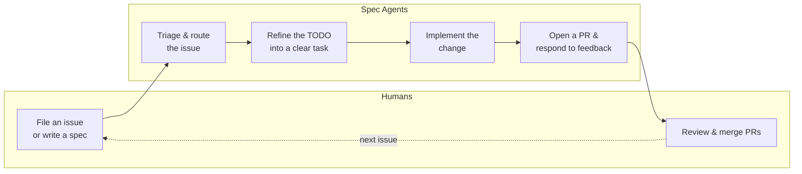
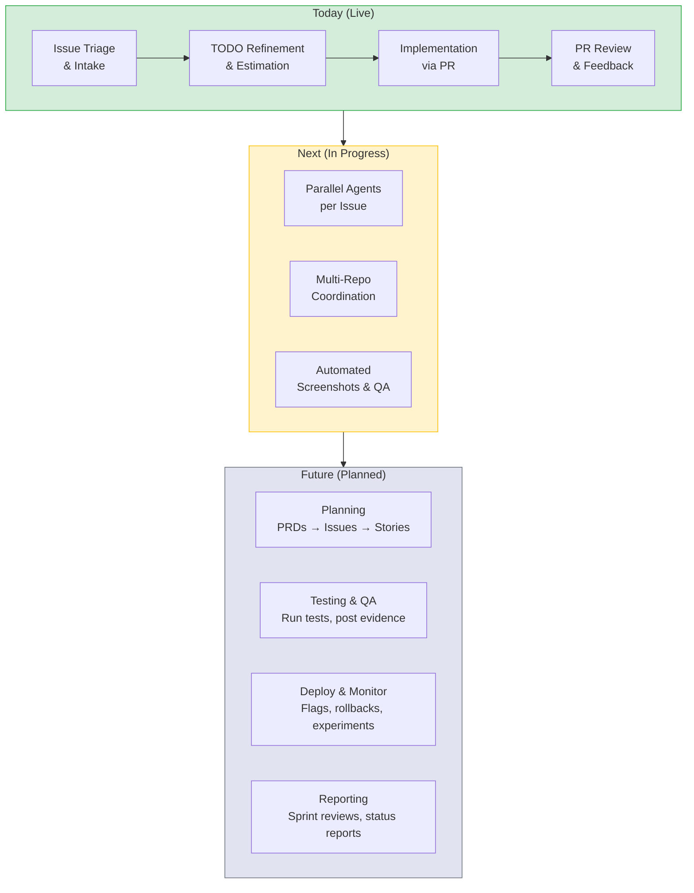

# Spec Agents

**AI agents that keep your codebase moving — autonomously.**

Spec Agents is a system for embedding AI agents directly into the software development lifecycle. The agents read specs, implement work, open pull requests, respond to reviewer feedback, and keep documentation in sync — all without a human in the loop.

No new tools. No process overhaul. Just markdown files in your repo and an AI that knows how to use them.

> *For a deeper look at the architecture, see [How It Works](how-it-works.md).*

---

## The Problem

Software teams spend enormous time on work that is necessary but not creative:

- **Triaging and routing issues** — reading new tickets, labeling them, figuring out who should look at them
- **Keeping docs in sync with code** — specs rot the moment they're written
- **Toil PRs** — dependency bumps, small refactors, boilerplate, and cleanup
- **Review follow-ups** — responding to reviewer comments, resolving merge conflicts, updating PR descriptions

This work is essential. It's also repetitive, well-defined, and exactly the kind of thing AI is good at.

---

## How It Works (30-Second Version)

Spec Agents operates on a simple loop:



1. **A human files an issue** or writes a TODO in a spec file — the way they already work.
2. **Agents triage and route** the issue into the right spec file, ask clarifying questions if anything is unclear.
3. **Agents refine the TODO** — estimating effort, breaking down vague asks, and flagging risks.
4. **Agents implement the change** — writing code, updating specs, and keeping everything in sync.
5. **Agents open a PR** — with a clear description, then respond to reviewer comments and resolve merge conflicts.
6. **A human reviews and merges.** That's the only step that requires a person.

The agents run on a schedule (via Docker cron or Kubernetes CronJobs), waking up periodically to check for new work. Each agent gets its own branch and PR — they don't step on each other.

> *For architecture details, diagrams, and configuration, see [How It Works](how-it-works.md).*

---

## Vision: The Autonomous SDLC

Today, Spec Agents handles the middle of the development lifecycle: issue intake, refinement, implementation, and PR management. The long-term vision is to cover the **entire SDLC** — from planning to post-deployment monitoring — with AI agents operating through GitHub.



### Where we're headed

**Planning moves into GitHub.** PRDs and high-level designs live as GitHub Issues and Discussions instead of external docs. Agents break large issues into smaller ones — replacing manual epic/story decomposition. Story pointing happens asynchronously with agent assistance.

**Testing becomes agent-driven.** Agents run tests, take screenshots, and post evidence on PRs — exactly like a human QA reviewer would. Test coverage gaps are flagged automatically.

**Deployment gets guardrails.** Agents monitor post-deployment metrics and can roll back changes or flip feature flags when problems are detected.

**Reporting is automatic.** Sprint reviews, velocity reports, and status updates are generated from the work that actually happened in GitHub — no manual slide-building required.

**The human role shifts from doing to directing.** Engineers focus on architecture, design decisions, and code review. The repetitive execution is handled by agents that never get tired and never cut corners.

---

## How to Get Started

Install the plugin in Claude Code:

```
claude plugin install spec-template@NoahWright87/spec-template
```

Then run `/what-now` from inside any repo. The assistant walks you through setup interactively. Nothing gets touched without your approval.

For autonomous operation (agents running on their own), see the [Worker deployment guide](../worker/README.md).

---

## Learn More

| Document | Audience | What it covers |
|----------|----------|---------------|
| [How It Works](how-it-works.md) | Technical leaders, architects | Architecture, spec system, worker runtime, onboarding |
| [Worker README](../worker/README.md) | Operators, SREs | Deployment, authentication, configuration |
| [Kubernetes Guide](../k8s/README.md) | SREs, platform engineers | K8s CronJobs, Kustomize overlays, multi-repo scaling |
| [Philosophy](../PHILOSOPHY.md) | Contributors, curious engineers | Design principles behind the system |
| [Contributing](../CONTRIBUTING.md) | Contributors | Codebase layout and editing conventions |
